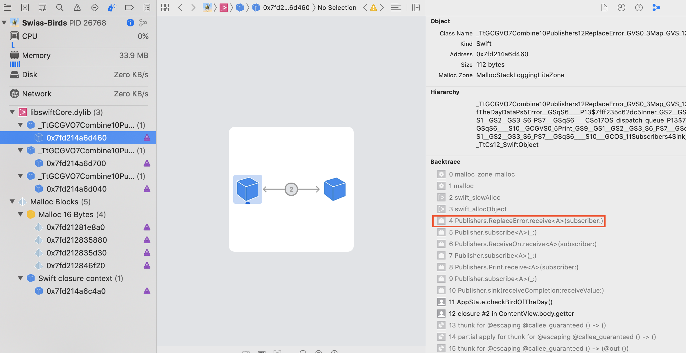

#  Memory leak in `Publisher.replaceError` 

This example code, which is derived from my full app (see master branch of https://github.com/pd95/Swiss-Birds-App), illustrates a memory leak caused by the `Publisher.replaceError()` modifier.

When the SwiftUI `ContentView` is displayed, a request for the "Bird of the day" is initiated (through `AppState.checkBirdOfTheDay`). In `VdsAPI.getBirdOfTheDaySpeciesIDandURL` a network request will load the homepage data from the base URL (`URLSession.dataTaskPublisher`). When the response is received, data is extracted, transformed and passed along the publisher chain. As the UI view does currently not care about possible errors, I use `replaceError(with: nil)` to simply ignore the response.

Here follows the relevant part of `AppState.swift` with the "error handling":
```swift
VdsAPI
    .getBirdOfTheDaySpeciesIDandURL()
    .map {Optional.some($0)}
    .replaceError(with: nil)     // FIXME
    .receive(on: DispatchQueue.main)
    .print()
    .sink(
        receiveCompletion: { (result) in
            print(result)
        },
        receiveValue: { [unowned self] (birdOfTheDay) in
            self.birdOfTheDay = birdOfTheDay
            self.showBirdOfTheDay = true
        })
```
With this implementation, the app leaks memory, as soon as the app has started.

1. Compile and run the app
2. Use "Debug Memory Graph" and find the following situation:
        
3. If you continue the execution and then press the button "Load image", the "bird of the day" will be displayed... and more memory was leaked, because the `AppState.getBirdOfTheDay` is similarly using the `replaceError` method to substitute a placeholder image in case an error occurs. See the code below:

```swift
VdsAPI
    .getBirdOfTheDay(for: speciesId)
    .map { data in
        let image = UIImage(data: data)
        return image
    }
    .replaceError(with: UIImage(named: "placeholder-headshot")) // FIXME
    .receive(on: DispatchQueue.main)
    .sink(
        receiveCompletion: { (result) in
            print(result)
        },
        receiveValue: { [unowned self] (image) in
            self.image = image
        })
```


## Workaround

Avoid `Publisher.replaceError` and handle the error in `.sink`