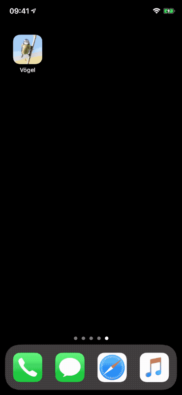
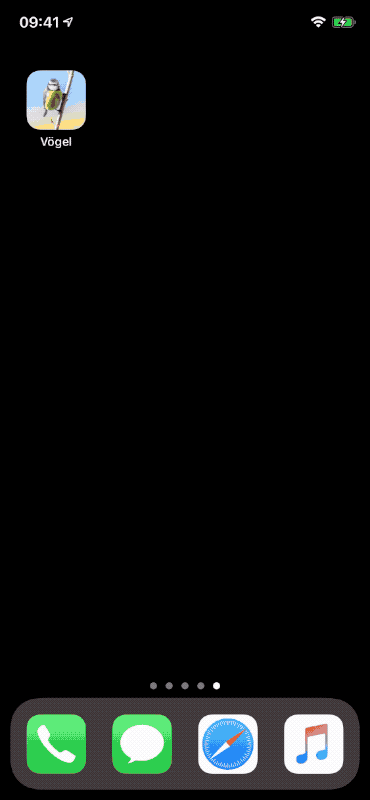

#  Birds of Switzerland

This is the missing app which I hoped would have been developed by [Swiss Ornithological Institute (SOI)](https://vogelwarte.ch). They do have a really nice website where you can lookup birds found in Switzerland and get more detailed information, but they are missing an iPhone app which makes the same information easily accessible "on the go".  
This is why I started to develop this app in November 2019.

The goal is to provide an app accessing the data of the website. It should allow the user to search through the vast list of birds (by name and category) and show more details.

This app is loading the list of birds, images and sounds from the website and caches them locally, so the already fetched data can be accessed "on the go".

## How to build the app

The script to prefetch the filter icons has to be executed before building the app. As the current implementation of the script is a mixture of unix shell and JavaScript, please make sure you have [node.js](https://nodejs.org) installed on your build machine.

1. Run the script `./fetch_data.sh` in the `data-scripts` directory.  
  This will first fetch the list of birds and filter categories, cleanup the data (remove duplicates) and then fetch detailed information, images and voices. Expected runtime: *10 minutes*

2. Run the script `./prepare_Filter.xcassets.sh`  
  This will create a `Filter.xcassets` folder containing the transformed SVG symbols for the filter categories.

3. Move the resulting `Filter.xcassets` into the app folder (along with `Assets.xcassets`): `mv Filter.xcassets ../Swiss-Birds/`

4. Start-up Xcode (at least version 13 is needed as the UI is completely build using SwiftUI) and try building the app for the simulator.  
  If you want to deploy the app to your device, you will have to create a `LocalConfig.xcconfig` file with the following content (updated to your developer account)

        // Local Config
        PRODUCT_BUNDLE_IDENTIFIER = Swiss-Birds
        DEVELOPMENT_TEAM = A1BC22XYZ
        CODE_SIGN_STYLE = Automatic

## Acknowledgments

1. [Swiss Ornithological Institute](https://vogelwarte.ch) for their information gathering and their research and conservation projects to support our native birds.    
They have also a great website with much more information.
2. [@kocher_sandra](https://twitter.com/kocher_sandra) for the permission to her photograph of a Blue Tit as icon and start-up image

## Impressions

 