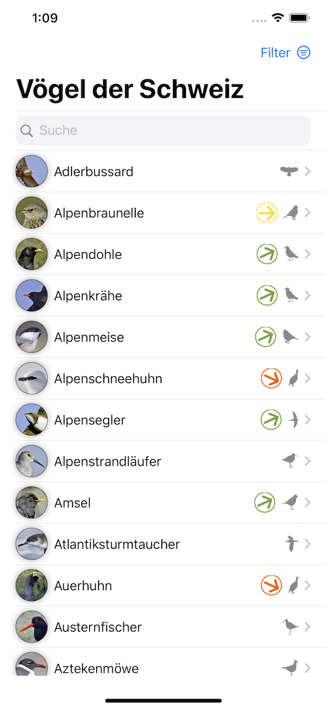
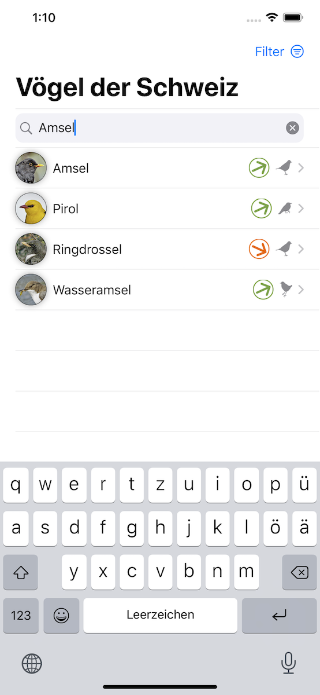
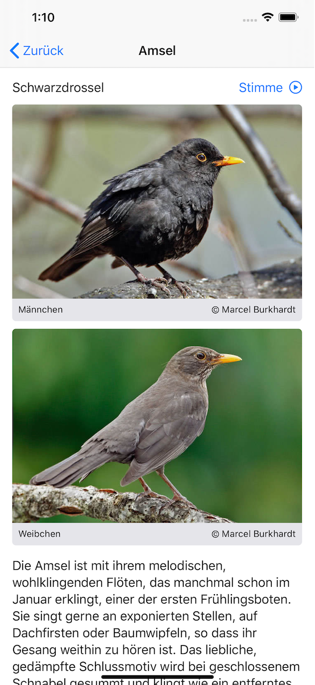
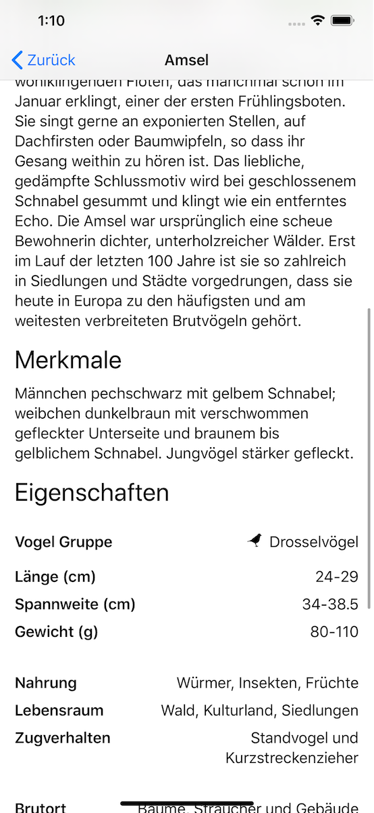
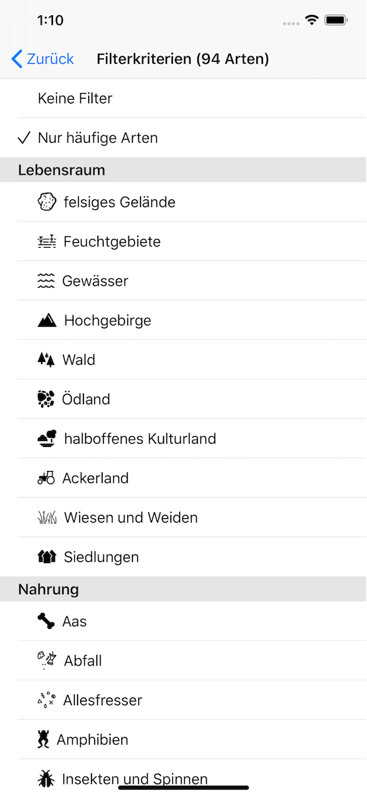

#  Birds of Switzerland

This is the missing app which I hoped would be have been developed by [Swiss Ornithological Institute (SOI)](https://vogelwarte.ch). They do have a really nice website where you can lookup birds found in Switzerland and get more detailed information, but they are missing an iPhone app which makes the same information easily accessible "on the go".  
This is why I started to develop this app in November 2019.

The goal is to provide an app accessing the data of the website. It should allow the user to search through the vast list of birds (by name and category) and show more details.

In the current initial version, the data has to be bundled with the app. There is currently no network data access done at runtime of the app.

Pros:
 + Speed (=no latency)
 + Data is accessible even when you are far in the wilderness

Cons:
 - Data increases the app size even if the data is not necessarily needed
 - Data can be outdated
 - SOI does not allow redistribution of their data, even though the data is publicly accessible on their website.

## How to build the app

The script to prefetch the data has to be executed before building the app. As the current implementation of the script is a mixture of unix shell and JavaScript, please make sure you have [node.js](https://nodejs.org) installed on your build machine.

1. Run the script `./fetch_data.sh` in the `scripts` directory.  
  This will first fetch the list of birds and filter categories, cleanup the data (remove duplicates) and then fetch detailed information, images and voices. Expected runtime: *10 minutes*

2. Run the script `./prepare_Birds.xcassets.sh`  
  This will create a `Birds.xcassets` folder containing the bird assets (images and voice data) and language folders (de/fr/it/en) containing the JSON data files.

3. Run the script `./prepare_Filter.xcassets.sh`  
  This will create a `Filter.xcassets` folder containing the transformed SVG symbols for the filter categories.

4. Move the resulting `Birds.xcassets` and `Filter.xcassets` into the app folder (along with `Assets.xcassets`).

5. Start-up Xcode and build the app.

## Impressions

