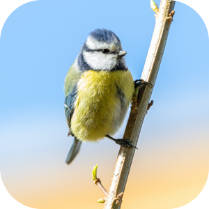

[English](../README.md)

#  Vögel der Schweiz

*Vögel der Schweiz* ist die fehlende App für iOS, von der ich gehofft hatte, sie würde von der [Schweizerischen Vogelwarte Sempach](https://www.vogelwarte.ch/de/) angeboten. Auf deren Website lassen sich zahlreiche in der Schweiz vorkommende Vogelarten nachschlagen sowie detaillierte Informationen und Fotos abrufen.

Um diese Informationen auch unterwegs einfach zugänglich zu machen, habe ich im November 2019 mit der Entwicklung von *Vögel der Schweiz* für iOS begonnen.

*Vögel der Schweiz* erlaubt es, Vögel in einer langen Liste nach Namen oder verschiedenen Kategorien zu suchen und Details dazu anzuzeigen. Besteht eine Internetverbindung, werden die gewünschten Daten von der Website der Schweizerischen Vogelwarte Sempach [https://www.vogelwarte.ch/de/voegel/voegel-der-schweiz/](https://www.vogelwarte.ch/de/voegel/voegel-der-schweiz/) geladen und lokal im Cache gespeichert, damit unterwegs auf diese bereits abgerufenen Daten zurückgegriffen werden kann.

*Vögel der Schweiz* befindet sich derzeit in einer geschlossenen Beta-Testphase. Bitte [kontaktieren Sie mich](mailto:philipp_dev@gmx.net?subject=Swiss-Birds-App%20beta) falls Sie eine Einladung erhalten möchten.

Voraussetzungen um die *Vögel der Schweiz* App zu installieren:

- iPhone oder iPad mit aktuellem iOS 13
- [Testflight app](https://apps.apple.com/ch/app/testflight/id899247664) von Apple
- Mobile Daten

## Copyright

*Vögel der Schweiz* wurde als Open Source Projekt geschrieben und ist mit dem vollständigen Source Code auf [GitHub](https://github.com/pd95/Swiss-Birds-App) verfügbar.  
Die Liste der Vögel, Fotos und Töne werden von der [Homepage der Vogelwarte Sempach](https://www.vogelwarte.ch/de/) geladen und gehören den entsprechenden Rechteinhaber. Sie dürfen nicht ohne Erlaubnis der Vogelwarte Sempach verwendet werden. [Mehr Details gibt es hier.](https://www.vogelwarte.ch/de/vogelwarte/impressum).

## Datenschutz

Lesen Sie [hier](privacy.md) die Datenschutzerklärung.

## Danksagungen

1. [Schweizerische Vogelwarte Sempach](https://www.vogelwarte.ch) für die umfangreiche Datensammlung und Forschung, die Schutzprojekte zur Unterstützung der heimischen Vögel sowie die detaillierte Webseite.
2. [@kocher_sandra](https://twitter.com/kocher_sandra) für die Erlaubnis, ihr Foto einer Blaumeise als Icon und für den Startbildschirm zu verwenden.

## Eindrücke

### Bildschirmfotos

<table class="screenshots">
  <thead>
    <tr>
      <th>Gerät</th>
      <th>Vogel des Tages</th>
      <th>Haupt&shy;seite</th>
      <th>Suche</th>
      <th>Detail (oben)</th>
      <th>Detail (mitte)</th>
      <th>Filter&shy;kriterien</th>
    </tr>
  </thead>
  <tbody>
    <tr>
      <td style="vertical-align:top; padding: 10px">iPhone</td>
      <td></td>
      <td></td>
      <td></td>
      <td></td>
      <td></td>
      <td></td>
    </tr>
    <tr>
      <td style="vertical-align:top; padding: 10px">iPad</td>
      <td></td>
      <td></td>
      <td></td>
      <td></td>
      <td></td>
      <td></td>
    </tr>
  </tbody>
</table>

### Bildschirmaufzeichnungen

